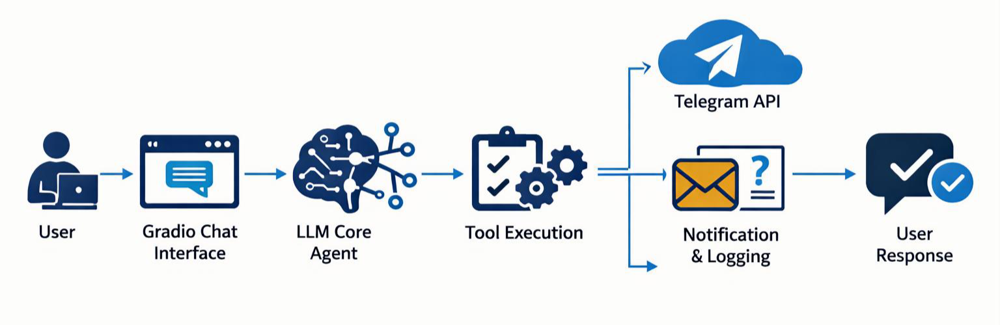

# career_agent

  

  🚀 <strong>Live Demo:</strong> 
  <a href="https://huggingface.co/spaces/sashour82/career_agent">
    https://huggingface.co/spaces/sashour82/career_agent
  </a>

---

## 🧠 Overview

`career_agent` is a production-deployed Agentic AI system that acts as a structured digital career representative.

This is not a simple chatbot.

It is a controlled AI agent that:

- Uses OpenAI function calling
- Executes tools deterministically
- Enforces persona constraints
- Logs unknown cases
- Captures leads via Telegram integration
- Runs live on Hugging Face Spaces

---

## 🏗 Architecture Highlights

The system follows a layered Agentic architecture:

- Presentation Layer (User • Gradio • HF Space)
- Agent Orchestration Layer (Prompt • Loop • LLM • Tool Registry)
- Tool Execution Layer (Structured Tool Mapping)
- Integration Layer (Telegram API)
- Observability Layer (Logging • Notifications)

This demonstrates structured autonomy and production-oriented AI design.

---

## ⚙️ Core Capabilities

- Deterministic tool orchestration
- Persona-controlled responses
- Automated lead capture
- Unknown question logging
- External API integration
- Cloud deployment

---

## 📦 Tech Stack

- Python
- OpenAI API (Function Calling)
- Telegram Bot API
- Gradio
- pypdf
- dotenv
- Hugging Face Spaces

---

## 🎯 Why This Project Matters

Most AI demos stop at text generation.

This project demonstrates:

- Controlled execution
- Backend integration
- Observability mindset
- Deployment readiness
- Real-world automation

It represents applied Agentic AI engineering — not experimental prompting.

---

## 🔮 Future Extensions

- Vector memory integration
- CRM connectivity
- Multi-agent collaboration
- Enterprise deployment patterns

---

## 📄 License

MIT
